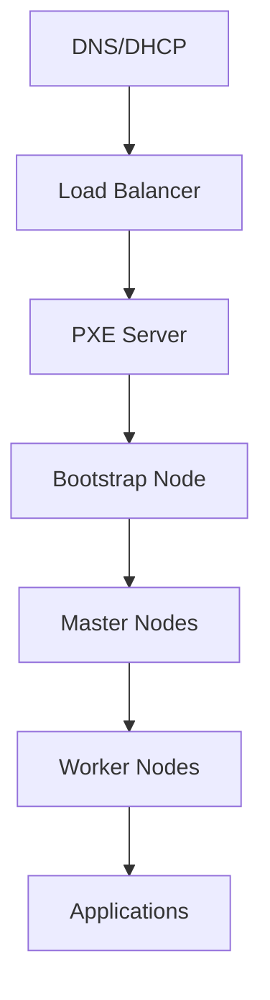

# Advanced Cluster Provisioning Framework

## Overview
Enhance Moxxie's cluster provisioning capabilities to support sophisticated, production-ready Kubernetes cluster deployments based on lessons learned from our successful OKD 4.19 deployment. This framework will support multiple cluster types, deployment methods, and advanced networking configurations.

## Background
Our recent OKD cluster deployment revealed several areas where Moxxie's cluster provisioning could be significantly enhanced:

**Successes to Build Upon:**
- Multi-node cluster coordination worked well
- VM placement and resource allocation was effective
- Network isolation (VLAN 107) provided proper security
- Load balancer integration was seamless

**Areas for Enhancement:**
- Need for sophisticated boot methods (PXE, ISO, templates)
- Role-based node configuration and lifecycle management  
- Advanced networking (dual-homed VMs, multiple VLANs)
- Integrated service deployment (DNS, DHCP, load balancers)
- Post-deployment cluster validation and monitoring

## Current Limitations

1. **Boot Method Restrictions**: Limited to cloud-init templates
2. **Network Complexity**: Difficulty with multi-homed and VLAN-aware deployments
3. **Service Integration**: Manual setup of supporting services (LB, DNS, DHCP)
4. **Cluster Lifecycle**: Limited post-deployment management
5. **Platform Support**: Focused mainly on traditional Linux distributions
6. **Validation**: Limited cluster health validation and readiness checks

## Requirements

### Core Framework Enhancements
1. **Multi-Boot Support**: Templates, ISO, PXE, and hybrid approaches
2. **Advanced Networking**: Multi-VLAN, dual-homed, and isolated deployments
3. **Service Orchestration**: Integrated deployment of supporting infrastructure
4. **Lifecycle Management**: Full cluster lifecycle from creation to decommission
5. **Platform Agnostic**: Support for OKD, Talos, RKE2, K3s, and vanilla Kubernetes

### Advanced Features
1. **Dependency Management**: Service dependencies and startup ordering
2. **Health Validation**: Comprehensive cluster readiness checks
3. **Configuration Management**: GitOps and configuration drift detection
4. **Disaster Recovery**: Backup, restore, and high availability planning
5. **Compliance**: Security policies and compliance validation

## Implementation Plan

### Phase 1: Framework Foundation (Priority: HIGH)

#### Step 1.1: Enhanced Cluster Models
**Files to create/modify:**
- `src/main/java/com/coffeesprout/model/cluster/ClusterDefinition.java`
- `src/main/java/com/coffeesprout/model/cluster/NodeGroup.java`
- `src/main/java/com/coffeesprout/model/cluster/ServiceDependency.java`
- `src/main/java/com/coffeesprout/model/cluster/BootConfiguration.java`

```java
public record ClusterDefinition(
    String name,
    ClusterType type,                    // OKD, TALOS, K3S, RKE2, VANILLA
    String version,
    BootMethod bootMethod,               // TEMPLATE, ISO, PXE, HYBRID
    NetworkConfiguration network,
    List<NodeGroup> nodeGroups,
    List<ServiceDependency> services,    // DNS, DHCP, LB, Storage
    SecurityConfiguration security,
    ValidationConfiguration validation,
    Map<String, Object> platformConfig
) {}

public record NodeGroup(
    String name,
    NodeRole role,                       // BASTION, BOOTSTRAP, CONTROL_PLANE, WORKER, INFRA
    int count,
    NodeTemplate template,
    PlacementConstraints placement,
    BootConfiguration boot,
    NetworkConfiguration network,
    List<String> tags,
    Map<String, String> metadata,
    LifecycleConfiguration lifecycle
) {}

public record ServiceDependency(
    String name,
    ServiceType type,                    // LOAD_BALANCER, DNS, DHCP, STORAGE, MONITORING
    Map<String, Object> configuration,
    List<String> dependsOn,
    boolean required,
    int startupOrder
) {}
```

#### Step 1.2: Boot Method Abstraction
**File to create:** `src/main/java/com/coffeesprout/service/BootMethodService.java`

Key methods:
- `prepareBootMethod(NodeGroup nodeGroup, BootConfiguration config)`
- `configureBoot(VM vm, BootMethod method, Map<String, Object> config)`
- `validateBootConfiguration(BootConfiguration config)`
- `cleanupBootResources(VM vm, BootMethod method)`

#### Step 1.3: Service Orchestration Engine
**File to create:** `src/main/java/com/coffeesprout/service/ServiceOrchestrationService.java`

Key methods:
- `planServiceDeployment(List<ServiceDependency> services)`
- `deployServices(List<ServiceDependency> services, String ticket)`
- `validateServiceDependencies(ServiceDependency service, List<ServiceDependency> deployed)`
- `teardownServices(List<ServiceDependency> services, String ticket)`

### Phase 2: Advanced Networking Support (Priority: HIGH)

#### Step 2.1: Multi-Network Configuration
**File to create:** `src/main/java/com/coffeesprout/service/MultiNetworkService.java`

Key methods:
- `configureDualHomed(VM vm, List<NetworkInterface> interfaces, String ticket)`
- `createIsolatedNetwork(NetworkConfiguration config, String ticket)`
- `assignStaticIPs(List<VM> vms, NetworkConfiguration config, String ticket)`
- `configureVLANs(List<NetworkInterface> interfaces, String ticket)`

#### Step 2.2: Network Service Integration
**File to create:** `src/main/java/com/coffeesprout/service/NetworkServiceManager.java`

Features:
- DNS service deployment and configuration
- DHCP service with static reservations
- Load balancer configuration and management
- Network policy enforcement
- Traffic routing and firewall rules

### Phase 3: Platform-Specific Provisioning (Priority: HIGH)

#### Step 3.1: Platform Provider Interface
**File to create:** `src/main/java/com/coffeesprout/service/platform/ClusterPlatformProvider.java`

```java
public interface ClusterPlatformProvider {
    ClusterType getSupportedType();
    List<BootMethod> getSupportedBootMethods();
    
    ClusterProvisioningPlan planProvisioning(ClusterDefinition definition);
    ClusterDeploymentResult deployCluster(ClusterProvisioningPlan plan, String ticket);
    ClusterValidationResult validateCluster(String clusterId, String ticket);
    
    void scaleCluster(String clusterId, ScalingConfig config, String ticket);
    void upgradeCluster(String clusterId, UpgradeConfig config, String ticket);
    void decommissionCluster(String clusterId, String ticket);
}
```

#### Step 3.2: OKD Platform Provider
**File to create:** `src/main/java/com/coffeesprout/service/platform/OKDPlatformProvider.java`

Features based on our successful deployment:
- Load balancer VM creation with dual networking
- Bootstrap node lifecycle management
- Master node coordination and cluster formation
- Worker node scaling and management
- Ignition config generation and serving

#### Step 3.3: Generic Kubernetes Provider
**File to create:** `src/main/java/com/coffeesprout/service/platform/GenericKubernetesPlatformProvider.java`

Features:
- Support for K3s, RKE2, kubeadm-based clusters
- Template-based deployments with cloud-init
- Certificate management and distribution
- CNI and CSI configuration

### Phase 4: Lifecycle Management (Priority: HIGH)

#### Step 4.1: Cluster Lifecycle Service
**File to create:** `src/main/java/com/coffeesprout/service/ClusterLifecycleService.java`

Key methods:
- `trackClusterState(String clusterId, ClusterState state)`
- `validateClusterHealth(String clusterId, ValidationConfig config)`
- `performClusterUpgrade(String clusterId, UpgradeConfig config)`
- `scaleCluster(String clusterId, ScalingOperation operation)`
- `backupCluster(String clusterId, BackupConfig config)`
- `restoreCluster(String clusterId, RestoreConfig config)`

#### Step 4.2: Health Validation Framework
**File to create:** `src/main/java/com/coffeesprout/service/ClusterHealthValidator.java`

Validation types:
- Infrastructure validation (VMs, networking, storage)
- Platform validation (Kubernetes API, etcd, core components)
- Application validation (ingress, DNS, service mesh)
- Security validation (certificates, policies, compliance)

### Phase 5: Configuration Management (Priority: MEDIUM)

#### Step 5.1: GitOps Integration
**File to create:** `src/main/java/com/coffeesprout/service/GitOpsService.java`

Features:
- Cluster configuration stored in Git repositories
- Automatic drift detection and remediation
- Configuration versioning and rollback
- Multi-environment promotion workflows

#### Step 5.2: Template Management
**File to create:** `src/main/java/com/coffeesprout/service/ClusterTemplateService.java`

Features:
- Pre-built cluster templates for common scenarios
- Template validation and testing
- Custom template creation and sharing
- Template versioning and inheritance

### Phase 6: Monitoring and Observability (Priority: MEDIUM)

#### Step 6.1: Cluster Monitoring Service
**File to create:** `src/main/java/com/coffeesprout/service/ClusterMonitoringService.java`

Features:
- Real-time cluster metrics collection
- Resource utilization tracking
- Performance baseline establishment
- Capacity planning recommendations

#### Step 6.2: Event and Audit System
**File to create:** `src/main/java/com/coffeesprout/service/ClusterAuditService.java`

Features:
- Complete audit trail of cluster operations
- Event correlation and analysis
- Compliance reporting
- Security incident tracking

## API Examples

### Deploy OKD Cluster with Load Balancer
```bash
curl -X POST http://localhost:8080/api/v1/clusters/provision \
  -H "Content-Type: application/json" \
  -d '{
    "name": "okd-production",
    "type": "OKD",
    "version": "4.19.0",
    "bootMethod": "PXE",
    "network": {
      "isolation": "VLAN",
      "privateVLAN": 107,
      "publicAccess": true
    },
    "services": [
      {
        "name": "load-balancer",
        "type": "LOAD_BALANCER",
        "configuration": {
          "dualHomed": true,
          "publicInterface": "vmbr0.3",
          "privateInterface": "vmbr0.107",
          "services": ["api", "ingress", "machine-config"]
        },
        "startupOrder": 1
      },
      {
        "name": "pxe-server", 
        "type": "PXE_BOOT",
        "configuration": {
          "dhcpRange": "10.1.107.100-150",
          "staticAssignments": true
        },
        "dependsOn": ["load-balancer"],
        "startupOrder": 2
      }
    ],
    "nodeGroups": [
      {
        "name": "bootstrap",
        "role": "BOOTSTRAP",
        "count": 1,
        "boot": {
          "method": "PXE",
          "configTemplate": "scos-bootstrap"
        },
        "placement": {
          "targetNodes": ["storage01"]
        },
        "lifecycle": {
          "temporary": true,
          "cleanupAfterBoot": true
        }
      },
      {
        "name": "masters", 
        "role": "CONTROL_PLANE",
        "count": 3,
        "boot": {
          "method": "PXE",
          "configTemplate": "scos-master"
        },
        "placement": {
          "antiAffinity": "SOFT",
          "preferredNodes": ["hv5", "hv6", "hv7"]
        }
      }
    ],
    "validation": {
      "waitForCluster": true,
      "timeoutMinutes": 45,
      "healthChecks": [
        "cluster-operators",
        "node-readiness",
        "api-availability"
      ]
    }
  }'
```

### Deploy K3s Cluster with Templates
```bash
curl -X POST http://localhost:8080/api/v1/clusters/provision \
  -H "Content-Type: application/json" \
  -d '{
    "name": "k3s-edge",
    "type": "K3S",
    "version": "v1.32.0+k3s1",
    "bootMethod": "TEMPLATE",
    "nodeGroups": [
      {
        "name": "server",
        "role": "CONTROL_PLANE", 
        "count": 1,
        "template": {
          "imageSource": "local-zfs:9001/ubuntu-24.04-template",
          "cloudInit": {
            "packages": ["curl", "jq"],
            "runCmd": [
              "curl -sfL https://get.k3s.io | sh -",
              "systemctl enable k3s"
            ]
          }
        }
      }
    ]
  }'
```

### Validate Cluster Health
```bash
curl -X POST http://localhost:8080/api/v1/clusters/okd-production/validate \
  -H "Content-Type: application/json" \
  -d '{
    "validationSuite": "COMPREHENSIVE",
    "categories": [
      "INFRASTRUCTURE",
      "KUBERNETES", 
      "SECURITY",
      "PERFORMANCE"
    ],
    "remediateIssues": false
  }'
```

### Scale Cluster 
```bash
curl -X PUT http://localhost:8080/api/v1/clusters/okd-production/scale \
  -H "Content-Type: application/json" \
  -d '{
    "nodeGroup": "workers",
    "targetCount": 5,
    "strategy": "ROLLING",
    "maxSurge": 1,
    "drainTimeout": "10m"
  }'
```

## Technical Implementation Details

### Service Dependency Graph


### Boot Method Hierarchy
1. **PXE**: Network-based, best for homogeneous deployments
2. **ISO**: Media-based, good for heterogeneous or offline deployments  
3. **Template**: Cloud-init based, fastest for traditional Linux
4. **Hybrid**: Combination approach for complex scenarios

### Validation Framework
- **Infrastructure**: VM, network, storage validation
- **Platform**: Kubernetes API, etcd, core components
- **Application**: Workload deployment and functionality
- **Security**: Certificate validity, policy compliance
- **Performance**: Resource utilization and bottlenecks

## Success Criteria

1. ✅ Multiple cluster types supported (OKD, Talos, K3s, etc.)
2. ✅ All boot methods work reliably (PXE, ISO, Template)
3. ✅ Complex networking scenarios supported
4. ✅ Service orchestration works seamlessly
5. ✅ Comprehensive cluster validation and health checking
6. ✅ Full cluster lifecycle management
7. ✅ GitOps integration for configuration management
8. ✅ Rich monitoring and observability
9. ✅ Backwards compatibility with existing functionality
10. ✅ Complete test coverage and documentation

## Benefits

1. **Unified Interface**: Single API for all cluster types
2. **Production Ready**: Enterprise-grade reliability and features
3. **Platform Agnostic**: Support for diverse Kubernetes distributions
4. **Intelligent Automation**: Smart defaults with override capabilities
5. **Comprehensive Validation**: Confidence in cluster deployments
6. **Lifecycle Management**: Full operational support
7. **Observability**: Deep insights into cluster health and performance

## Future Enhancements

1. **Multi-Cloud**: Support for cloud provider integrations
2. **Edge Computing**: ARM64 and edge-optimized deployments
3. **Service Mesh**: Automatic Istio/Linkerd deployment
4. **Policy Engine**: OPA/Gatekeeper integration
5. **Disaster Recovery**: Cross-cluster backups and failover
6. **Cost Optimization**: Resource right-sizing recommendations
7. **AI/ML Workloads**: GPU scheduling and optimization
8. **Compliance**: Automated security and compliance scanning

## Risk Mitigation

1. **Complexity Management**: Phased rollout with fallback options
2. **Backwards Compatibility**: Existing cluster provisioning continues to work
3. **Resource Constraints**: Intelligent resource allocation and validation
4. **Network Conflicts**: Comprehensive network topology validation
5. **Service Failures**: Robust error handling and cleanup procedures
6. **Security**: Zero-trust networking and security by default

## Integration Points

1. **Existing VM Management**: Leverage current VM provisioning
2. **Network Infrastructure**: Build on existing VLAN support
3. **Storage Systems**: Integrate with current storage management
4. **Monitoring**: Extend existing monitoring infrastructure
5. **Security**: Apply existing safety and audit features
6. **APIs**: Maintain consistent REST API patterns

This framework represents the evolution of Moxxie from a VM management tool to a comprehensive cluster orchestration platform, capable of deploying and managing production-grade Kubernetes clusters with enterprise features and reliability.