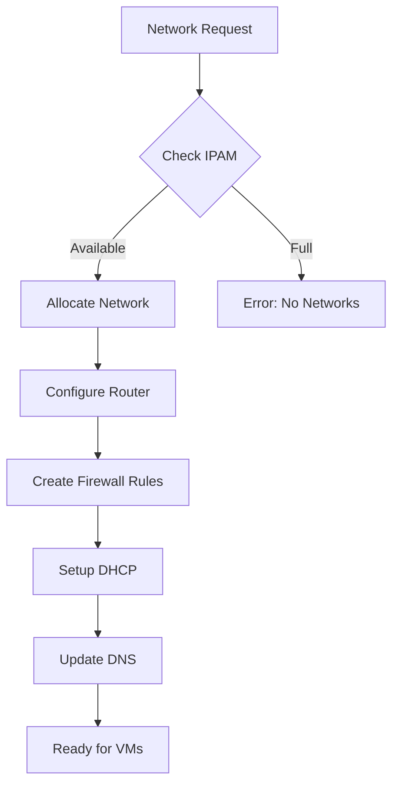

# Implement Complete Network Provisioning Workflow

## Overview
Create an end-to-end workflow for provisioning networks that integrates IPAM, RouterOS API, and VM creation.

## Workflow Steps



## API Design

### Network Provisioning Request
```json
POST /api/v1/networks/provision
{
  "clientId": "acme-corp",
  "type": "production",
  "datacenter": "DC1",
  "size": "/24",
  "options": {
    "enableDHCP": true,
    "firewallProfile": "standard",
    "bgpEnabled": false,
    "description": "ACME production network"
  }
}
```

### Response
```json
{
  "networkId": "net-12345",
  "vlanId": 150,
  "subnet": "172.16.150.0/24",
  "gateway": "172.16.150.1",
  "dhcpRange": "172.16.150.100-172.16.150.200",
  "datacenter": "DC1",
  "status": "provisioned",
  "provisioningSteps": [
    {
      "step": "ipam_allocation",
      "status": "completed",
      "timestamp": "2024-12-24T10:00:00Z"
    },
    {
      "step": "router_vlan_creation",
      "status": "completed",
      "timestamp": "2024-12-24T10:00:05Z"
    },
    {
      "step": "firewall_rules",
      "status": "completed",
      "timestamp": "2024-12-24T10:00:10Z"
    },
    {
      "step": "dhcp_configuration",
      "status": "completed",
      "timestamp": "2024-12-24T10:00:15Z"
    }
  ]
}
```

## Implementation

### Provisioning Service
```java
@ApplicationScoped
@AutoAuthenticate
public class NetworkProvisioningService {
    
    @Inject IPAMService ipamService;
    @Inject RouterOSService routerService;
    @Inject FirewallService firewallService;
    @Inject DNSService dnsService;
    
    @Transactional
    public NetworkProvisioningResult provision(NetworkRequest request) {
        var result = new NetworkProvisioningResult();
        
        try {
            // Step 1: Allocate from IPAM
            NetworkAllocation allocation = ipamService.allocate(
                request.datacenter(),
                request.size(),
                request.clientId()
            );
            result.recordStep("ipam_allocation", "completed");
            
            // Step 2: Configure router
            routerService.createVlan(
                request.datacenter(),
                allocation.getVlanId(),
                generateVlanName(request.clientId())
            );
            
            routerService.addIpAddress(
                request.datacenter(),
                allocation.getGateway() + "/" + allocation.getCidr(),
                "vlan" + allocation.getVlanId()
            );
            result.recordStep("router_configuration", "completed");
            
            // Step 3: Firewall rules
            applyFirewallProfile(
                request.datacenter(),
                allocation,
                request.options().firewallProfile()
            );
            result.recordStep("firewall_rules", "completed");
            
            // Step 4: DHCP if requested
            if (request.options().enableDHCP()) {
                configureDHCP(request.datacenter(), allocation);
                result.recordStep("dhcp_configuration", "completed");
            }
            
            // Step 5: DNS updates
            updateDNS(allocation);
            result.recordStep("dns_update", "completed");
            
            return result.success(allocation);
            
        } catch (Exception e) {
            // Rollback on failure
            rollback(result.getCompletedSteps());
            throw new NetworkProvisioningException(
                "Failed to provision network", e
            );
        }
    }
}
```

### Firewall Profiles
```java
public enum FirewallProfile {
    STANDARD("""
        # Allow established
        /ip firewall filter
        add chain=forward connection-state=established,related \\
            src-address=%s action=accept
        
        # Allow outbound
        add chain=forward src-address=%s action=accept
        
        # Block inbound except from management
        add chain=forward dst-address=%s \\
            src-address=!172.16.10.0/24 action=drop
        """),
        
    ISOLATED("""
        # Only allow management access
        /ip firewall filter
        add chain=forward src-address=%s \\
            dst-address=172.16.10.0/24 action=accept
        add chain=forward dst-address=%s \\
            src-address=172.16.10.0/24 action=accept
        add chain=forward src-address=%s action=drop
        add chain=forward dst-address=%s action=drop
        """),
        
    OPEN("""
        # Allow all (not recommended)
        /ip firewall filter
        add chain=forward src-address=%s action=accept
        add chain=forward dst-address=%s action=accept
        """);
        
    private final String template;
}
```

### Rollback Support
```java
public class NetworkRollbackService {
    
    public void rollback(List<ProvisioningStep> steps) {
        // Reverse order rollback
        steps.reversed().forEach(step -> {
            switch (step.getName()) {
                case "router_configuration" -> {
                    routerService.deleteVlan(step.getDatacenter(), step.getVlanId());
                }
                case "ipam_allocation" -> {
                    ipamService.release(step.getNetworkId());
                }
                case "dhcp_configuration" -> {
                    routerService.deleteDhcpServer(step.getDatacenter(), step.getVlanId());
                }
                // ... other rollback steps
            }
        });
    }
}
```

### Status Tracking
```java
@Entity
public class NetworkProvisioningJob {
    @Id
    private String jobId;
    private String networkId;
    private ProvisioningStatus status; // PENDING, IN_PROGRESS, COMPLETED, FAILED
    private String currentStep;
    private String errorMessage;
    private LocalDateTime startTime;
    private LocalDateTime endTime;
    
    @OneToMany
    private List<ProvisioningStep> steps;
}
```

## Error Handling

### Common Failures
1. **VLAN exhaustion** - Return clear error with suggestion
2. **Router API timeout** - Retry with backoff
3. **IP conflict** - Validate before provisioning
4. **Rollback failure** - Log and alert operations

### Monitoring Integration
```java
@Produces
@ApplicationScoped
public class NetworkProvisioningMetrics {
    
    @Metric(name = "network_provisioning_total")
    Counter provisioningAttempts;
    
    @Metric(name = "network_provisioning_success")
    Counter provisioningSuccess;
    
    @Metric(name = "network_provisioning_duration")
    Histogram provisioningDuration;
    
    @Metric(name = "network_rollback_total")
    Counter rollbackCount;
}
```

## Testing Requirements
- [ ] Unit tests for each provisioning step
- [ ] Integration tests with router simulator
- [ ] Test rollback scenarios
- [ ] Test concurrent provisioning
- [ ] Load test provisioning service

## Acceptance Criteria
- [ ] Can provision complete network in <30 seconds
- [ ] Rollback works for any failure point
- [ ] Clear error messages for common failures
- [ ] Provisioning is idempotent
- [ ] Status tracking for async operations
- [ ] Comprehensive audit logging

Labels: `enhancement`, `networking`, `workflow`
Milestone: Network Integration